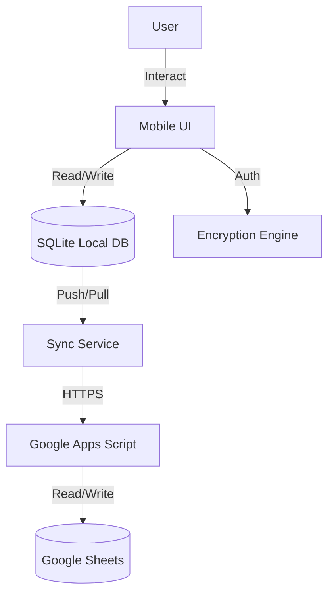

# Project Summary: Password Manager Application

## 📖 Overview
KeyVault Pro is a secure, offline-first password management server designed for mobile platforms. It leverages a serverless architecture using Google Sheets as the backend database, ensuring user data ownership and zero infrastructure costs. The application is built with React Native and Expo, providing a seamless cross-platform experience on Android and iOS.

## ✨ Key Features
*   **Zero-Knowledge Architecture**: All data is encrypted locally before leaving the device.
*   **Offline-First**: Full functionality without an internet connection; data syncs automatically when online.
*   **Cross-Platform Sync**: Real-time synchronization across devices using Google Sheets.
*   **Secure Authentication**: PIN-based access with Master Password encryption.
*   **Conflict Resolution**: Smart handling of concurrent edits and "Last-Write-Wins" logic.
*   **Modern UI**: Dark mode support, intuitive navigation, and biometric-ready design.

---

## 🏗️ Technical Architecture

### High-Level Design
The system follows a thick-client architecture where the mobile device handles all cryptography and business logic. The backend acts solely as a dumb data store.



### Technology Stack
*   **Frontend**: React Native (0.81.5), Expo SDK 54.
*   **Navigation**: React Navigation 7.x.
*   **Local Storage**: `expo-sqlite` (Mobile), `AsyncStorage` (Web fallback).
*   **State Management**: React Context & Hooks.
*   **Backend**: Google Apps Script (Serverless Node.js-like environment).
*   **Database**: Google Sheets (NoSQL-like usage).
*   **Cryptography**: `crypto-js` (AES-256-CBC, PBKDF2), `expo-crypto` (SHA-256, Random).

---

## 🔒 Security & Cryptography

This application implements rigorous security measures to protect user credentials involving industry-standard encryption protocols.

### 1. Encryption Model
*   **Algorithm**: AES-256-CBC (Advanced Encryption Standard).
*   **Key Derivation**: PBKDF2 (Password-Based Key Derivation Function 2) with 1000 iterations.
*   **Hashing**: SHA-256 is used for integrity verification and PIN authentication.

### 2. Per-User Salt Implementation
To defend against rainbow table attacks and ensure unique encryption keys across users, the system employs a unique salt per user.

*   **Generation**: A 256-bit random salt is generated upon account creation or first login.
*   **Storage**:
    *   **Cloud**: Stored in a named Firestore database (`keyvault-pro-india`) under `users/{userId}`.
    *   **Local**: Cached securely in `expo-secure-store`.
*   **Conflict Resolution**: Automated logic detects salt mismatches (e.g., offline setup on a new device) and re-encrypts local data to match the authoritative cloud salt.

### 3. Data Flow Security
1.  **At Rest (Local)**: Data is encrypted in SQLite/SecureStore.
2.  **In Transit**: Transport Layer Security (TLS/HTTPS) protects data during sync.
3.  **At Rest (Cloud)**: Data in Google Sheets is strictly an encrypted blob (ciphertext). The encryption key **never** leaves the user's device.

---

## 🔄 Synchronization Mechanism

The bidirectional sync engine ensures data consistency between the local device and the cloud.

### Triggers
*   Application startup.
*   Network status change (Offline -> Online).
*   Manual pull-to-refresh.
*   Post-modification (Add/Edit/Delete).

### Logic
1.  **Push**: Uploads local changes (dirty records) to the cloud.
2.  **Pull**: Downloads the latest data from the cloud.
3.  **Merge**:
    *   **Newer Wins**: Compares `lastModified` timestamps.
    *   **Tombstones**: Deleted items are marked with `isDeleted` and a timestamp to propagate deletions across devices before final cleanup (30-day retention).
4.  **Batching**: Operations are batched (50 items/batch) to respect Google API quotas.

---

## 📁 Project Structure

```text
password-manager/
├── docs/                        # Project documentation
├── google_apps_script.js        # Backend source code
└── mobile/                      # React Native Application
    ├── src/
    │   ├── components/          # Reusable UI components
    │   ├── screens/             # Application views
    │   ├── services/            # Business logic (Sync, Crypto, DB)
    │   ├── context/             # Global state management
    │   └── utils/               # Helper functions
    ├── assets/                  # Images and static resources
    └── app.json                 # Expo configuration
```

---

## 📈 Performance Characteristics

*   **Storage**: Extremely lightweight. 1000 passwords consume < 1MB JSON.
*   **Bandwidth**: Differential sync transmits only changed records.
*   **Battery**: Background tasks are minimized; network monitoring uses OS-native events.
*   **Boot Time**: < 2 seconds to interactive state (loads from local DB first).

---

## 🔮 Roadmap & Future Enhancements

*   [ ] **Biometric Unlock**: Integration with FaceID/TouchID.
*   [ ] **Password Generator**: Configurable strong password creation tool.
*   [ ] **Import/Export**: Support for CSV/JSON backup.
*   [ ] **Group Sharing**: Securely share credentials between users (requires public key crypto).
*   [ ] **Desktop App**: Electron-based wrapper for desktop usage.

---

## 📄 License & Maintenance
*   **License**: MIT License.
*   **Maintenance**: Regular dependency updates via `npm check-updates`.
*   **Monitoring**: Client-side error logging (optional integration) and Google Apps Script execution logs.
